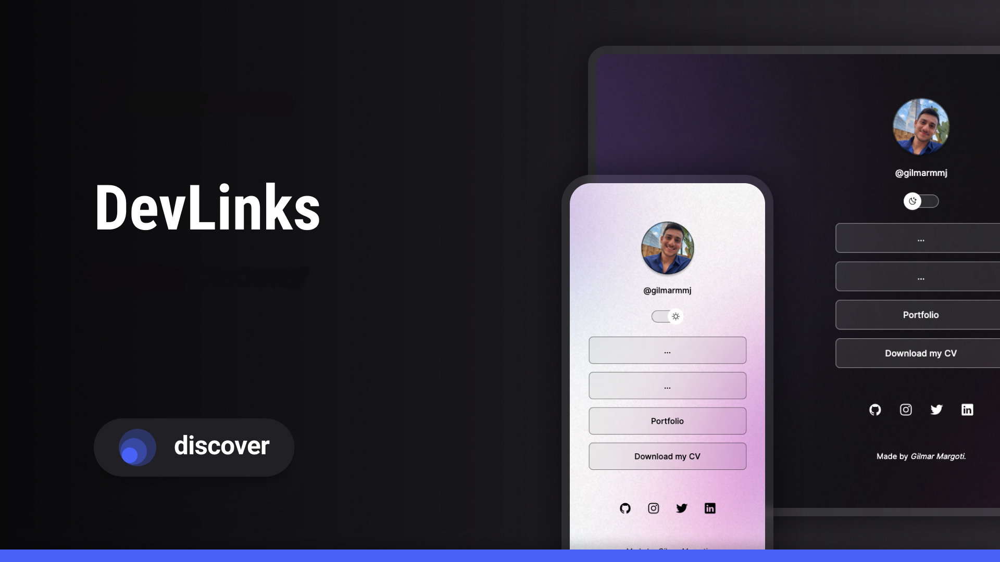

<h1 align="center"> DEVLinks </h1>

It is a free technology web program school provided by Rocketseat through online courses from Brasil.

  <a href="#-technologies">Technologies</a>&nbsp;&nbsp;&nbsp;|&nbsp;&nbsp;&nbsp;
  <a href="#-project">Project</a>&nbsp;&nbsp;&nbsp;|&nbsp;&nbsp;&nbsp;
  <a href="#-layout">Layout</a>&nbsp;&nbsp;&nbsp;|&nbsp;&nbsp;&nbsp;
  <a href="#memo-license">License</a>

  

 

  

## 🚀 Technologies

In this project I used the following technologies:

- HTML & CSS
- JavaScript
- Git & Github
- Figma

## 💻 Project

DevLink is a project where I can keep all my personal and professional links as instagram, protfolio, github, linkedin, etc in the same webpage as a business card.

## 🔖 Layout

You can check the project layout by [HERE](<https://www.figma.com/file/Yj61wETKU3ydtApl0h6iq0/DevLinks-•-Projeto-Discover-(Community)?node-id=10%3A620&mode=dev>). You need to hold a Figma account [Figma](https://figma.com) for the access.

## :memo: License

This project is under MIT license.

---
